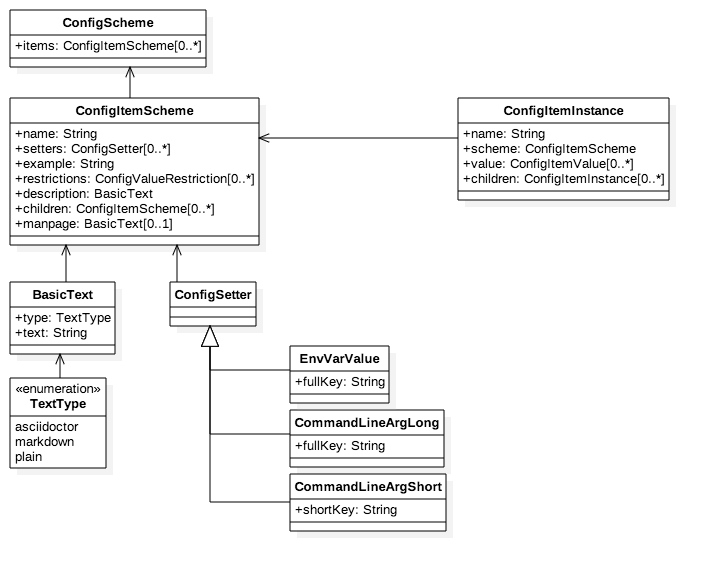
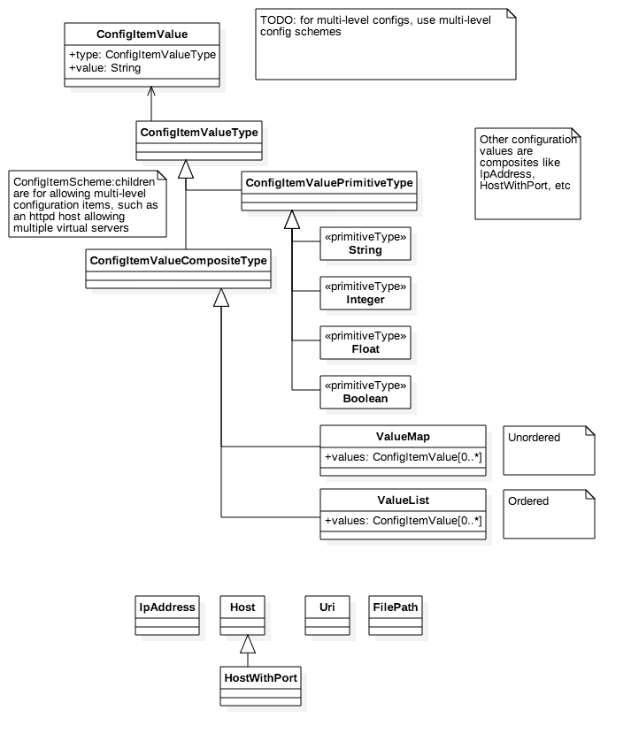

= Nereon Event and Configuration Models

This repository presents the Nereon configuration and Nerelog event models.

It is used to abstract the common `syslog` log line and the myriad
configuration formats.

More information (and implementations of these) on the main
https://github.com/riboseinc/nereon[Nereon] page.

== Standard Event Models

=== Process and Event

image::images/png/Nerelog__ProcessEvent_0.png[]

=== Configuration Scheme

=== Configuration Values

=== Configuration Value Restrictions

== Examples

=== Event example: RVC/RVD

image::images/png/Nerelog__RvdLogEvent_2.png[]

=== Event example: Sophos

image::images/png/Nerelog__SophosEvent_1.png[]

