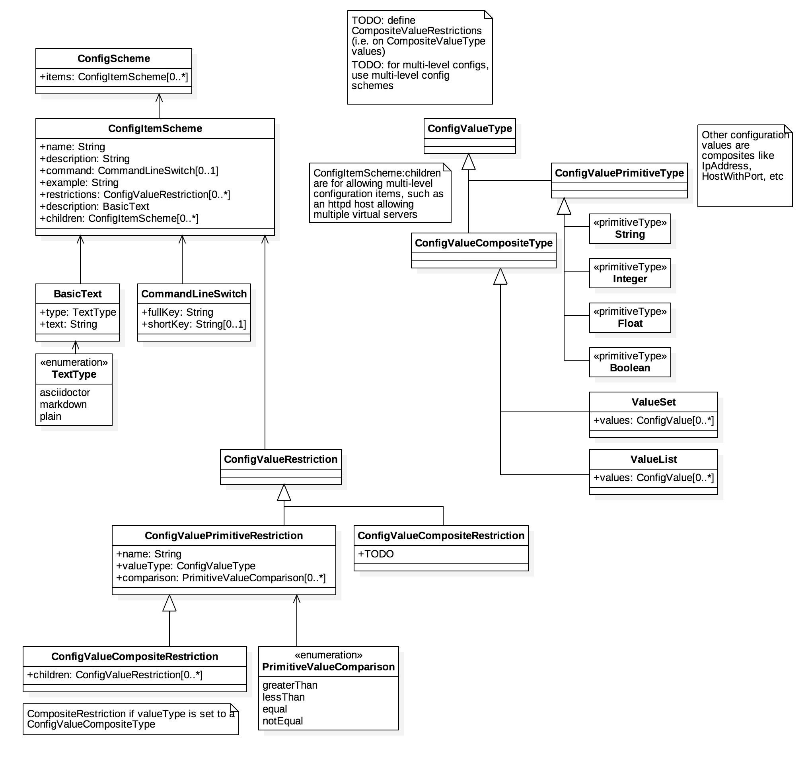

= Common Event and Configuration Models

This is a family of models intended to represent events and configuration
items. It is used to abstract the common log line and the myriad
configuration formats.

== Standard Event Models

=== Process and Event

image::images/process-event.png[]

=== Configuration Scheme

=== Example: RVC/RVD

image::images/rvd-event.png[]

=== Example: Sophos

image::images/sophos-event.png[]

