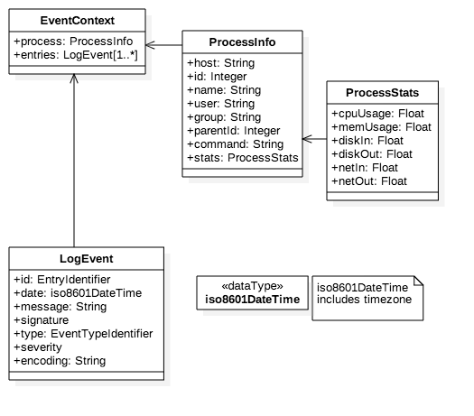
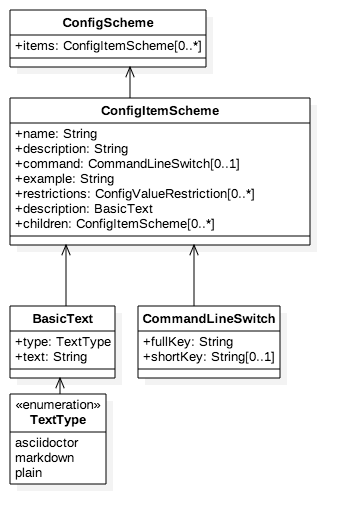
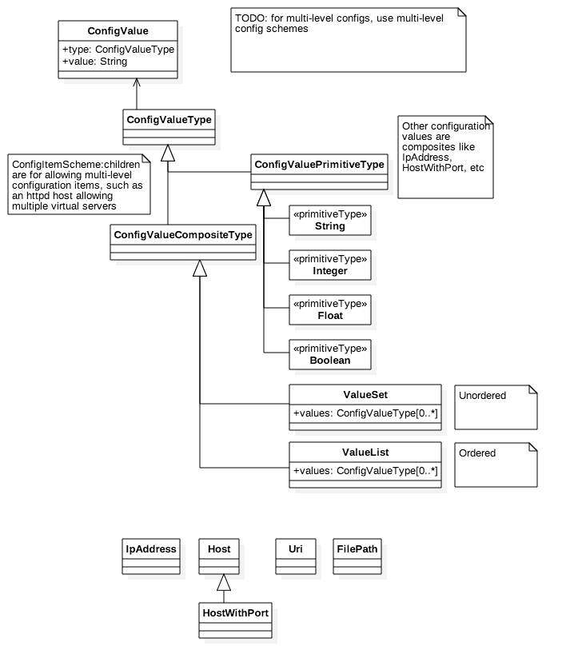
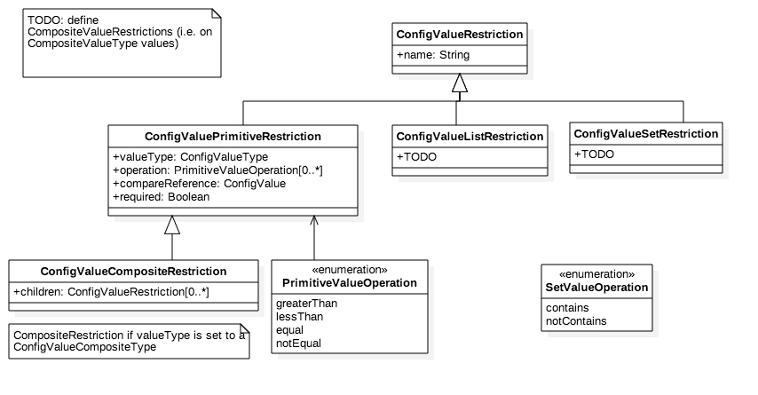
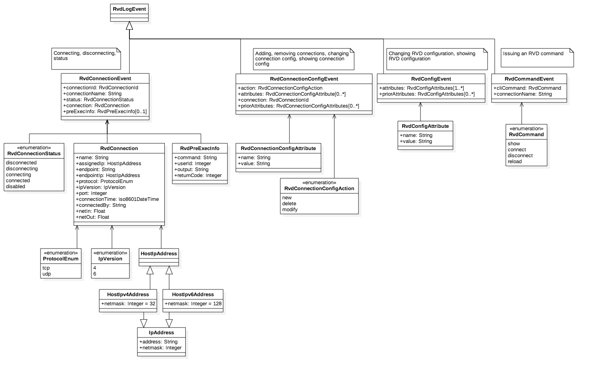
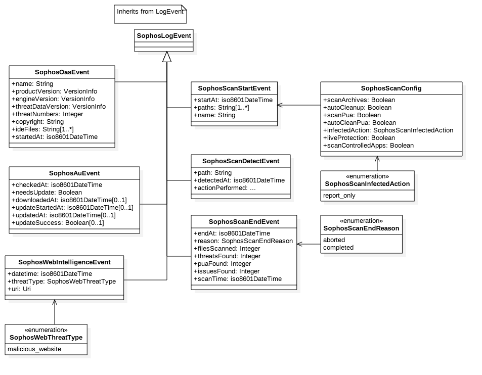

= Common Event and Configuration Models

This is a family of models intended to represent events and configuration
items. It is used to abstract the common log line and the myriad
configuration formats.

Configuration model tools in Go are implemented in the library:
https://github.com/riboseinc/go-multiconfig

== Standard Event Models

=== Process and Event

=== Configuration Scheme

=== Configuration Values

=== Configuration Value Restrictions

== Examples

=== Event example: RVC/RVD

=== Event example: Sophos

